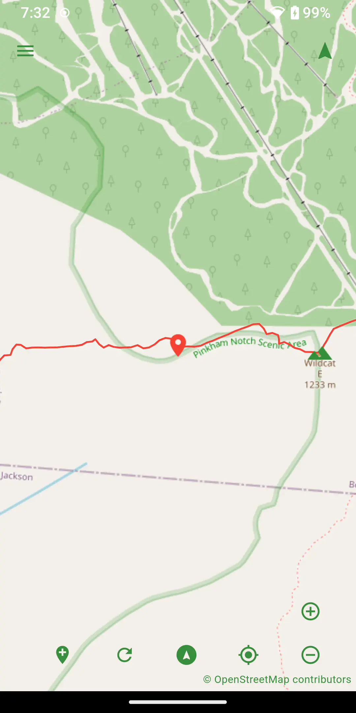

# Mappoff

Mappoff was created for and maintained by hikers. Because it is often neccesary to do MAPPing OFFline when in remote areas, Mappoff allows you to save map layers and tiles for later offline use. Additionally you can create your own waypoints or enable tracking to save hiking routes. There are several [preset](#presets) layers including the [PCT Water Report](https://www.google.com/maps/d/viewer?mid=1UtogyvQzegPXZYLARMCTwckZTRxIOOLf), the Appalachian Trail, the Continental Divide Trail, the Pacific Crest Trail, among others.

For Wear OS users, there is a slimmed down [version](https://github.com/jithware/mappoff_wear#mappoff-wear) available as well.

     
*The web version has a limited amount of features and can only be used while [online](https://github.com/flutter/flutter/issues/60069). iOS/macOS users can only use the [unsupported](https://github.com/jithware/brethap/discussions/95) web version at this time.*

## Screenshots

## Usage

### Location

To move the map to your current location, press the Location button. Accept the location permission while using the application. Press the Location button again.

### Zoom

To zoom in or out, pinch the screen in or out or press the Zoom In or Zoom Out buttons. To zoom to the layer's extent, hold down either the Zoom In or Zoom Out button. To zoom to a placemark, press the placemark cluster and then press the placemark. 

### Move 

To move the map, touch anywhere on the map and drag to the location to move to.

### Preferences

To modify preferences, press Preferences from the menu. Update your Trail Name if desired. This will be used when [sharing](#share) placemarks. Adjust the Default Zoom. This will be used when [zooming](#zoom) to a placemark. Set the Metric Units if you prefer to use metric. This will be used when viewing distances of [placemarks](#placemarks).

### Placemarks

To view the description of a placemark, press the placemark to open a pop-up. To jump to the placemark in the list of placemarks, press the placemark pop-up. Scroll up or down to view placemarks. Press a placemark to move the map to the placemark. You can also scroll the description in the placemark pop-up as well. Press the screen away from the placemark to remove the placemark pop-up.

### Placemark

To add a new placemark, press the Add Point button to center the placemark on the map or long press a location on the screen. Press the Save button. To edit a placemark, long press the placemark and update the desired fields. Press the Save button.

### Layers

To add a new layer, press Layers from the menu. From the Layers screen, press the Add button. Press the New File button and the press the Add button to add the layer. To edit a layer, long press the layer to edit. Update the desired fields and press the Save button. To enable or disable a layer, press the checkbox. To remove a layer, swipe the layer either left or right.  

### Edit

To edit multiple layers, first create multiple [layers](#layers). Ensure the Edit checkbox is checked for layers to be edited. Adding a [placemark](#placemark) will add it to multiple layers. To edit only one layer, ensure only the desired layer Edit is checked. 

### Open

To open a local layer, first download a kml or kmz file. Press Layers from the menu. From the Layers screen, press the Add button. Press the Open File button and select the kml or kmz file you downloaded. Press the Add button again.

### Network

To open a network layer, first locate the url of a kml or kmz file. Copy the kml or kmz url to the clipboard. Press Layers from the menu. From the Layers screen, press the Add button. Paste the url in the URI field. Press the Add button again. An advantage of using a network layer is that upon refresh, the layer will be up to date with the most recent kml version.

### Cache

To cache map tiles for offline use, [edit](#layers) the layer and select the Cache Tiles checkbox. Adjust the Tile Cache Size to the desired amount of tiles to cache. Adjust the Tile Cache Range to modify the range of tiles to cache. For example, a range of 0-25 will cache the first 25% of points and lines in the layer. This allows for higher zoom resolution of the tiles cached. Press the Save button to save changes. Press the Download button to download the tiles.

*Because tiles are stored in the application cache, it is possible the operating system will clear the cache from time to time. You may want to periodically download tiles after a period of time. If you uninstall the application, the application cache will be cleared.*

### Show

To show only points in a Layer, [edit](#layers) the layer and select only the points checkbox. Press the Save button. To show only lines, do the same for the lines checkbox. 

*If this is an editable layer, it will remove the points and/or lines. An edit checkbox will be visble if the layer is editable.*

### Tracking

To start tracking, press the Track button. Select the Allow all the time permission. Adjust the desired Tracking Interval and/or Tracking Distance Filter from the Preferences menu. Tracking Interval is time between tracking points. Tracking Distance Filter is the minimum amount of distance in meters that must be between points for a new point to be created. To stop tracking, press the Track button again.

### Presets

To load a preset layer, press Layers from the menu. From the Layers screen, press the Presets button. Press the layer icon to view a thumbnail. Press the preset you would like to load. Press the layer to view the preset placemarks. Press a placemark to jump to the placemark on the map.

### Equalize

If it appears the map is lagging when drawn, either disable/remove other layers or equalize the lines in the layer. Equalizing reduces the number of lines drawn. To equalize the lines in a layer, begin editing the layer. Increase the equalize to reduce the number of lines. Press the Save button. Notice the lines and distance are reduced in the Layer description. 

### Export

To export a layer, first create a new [layer](#layers). Edit the layer and select the Share button. Choose a method to share with.

### Share

To share a placemark, long press the placemark. Press the Share button. Edit the desired fields. Press the Send button. Choose the desired method of sharing. Update who to share with. Send the message. An advantage to using email as the share method is that when you are offline, your email client should queue up your messages and send them once you return online. See this [video](https://youtu.be/cBffu9NST_M) for an additional sharing demo.

     
## Donate

Donate to the project's maintainer [@jithware](https://github.com/jithware)

 | 
