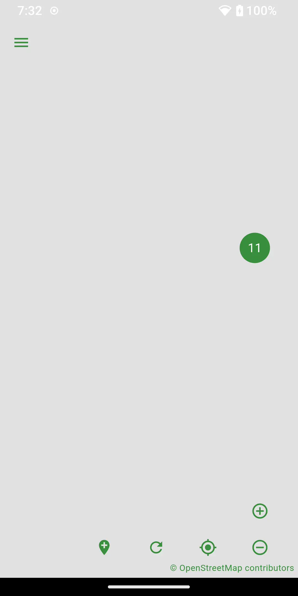

# Mappoff

Mappoff was created for and maintained by hikers. Because it is often neccesary to do MAPPing OFFline when in remote areas, Mappoff allows you to save map layers and tiles for later offline use. Additionally you can create your own waypoints or enable tracking to save hiking routes. There are several preset layers including the PCT Water Report, the Appalachian Trail, the Continental Divide Trail, the Pacific Crest Trail, among others.

## Usage

### Location

To move the map to your current location, press the Location button. Accept the location permission while using the application. Press the Location button again.

### Zoom

To zoom in or out, pinch the screen in or out or press the Zoom In or Zoom Out buttons. To zoom to the layer's extent, hold down either the Zoom In or Zoom Out button. To zoom to a placemark, press the placemark cluster and then press the placemark. Press the screen away from the placemark to remove the placemark pop-up.

### Placemarks

To view the description of a placemark, press the placemark to open a pop-up. To jump to the placemark in the list of placemarks, press the placemark pop-up. Scroll up or down to view placemarks. Press a placemark to move the map to the placemark. You can also scroll the information in the placemark pop-up.

### Placemark

To add a new placemark, press the Add Point button to center the placemark on the map or long press a location on the screen. Press the Save button. To edit a placemark, long press the placemark and update the desired fields. Press the Save button.

### Layers

To add a new layer, press Layers from the menu. From the Layers screen, press the Add button. Press the New File button and the press the Add button to add the layer. To edit a layer, long press the layer to edit. Update the desired fields and press the Save button. To enable or disable a layer, press the checkbox. To remove a layer, swipe the layer either left or right.

### Cache

To cache map tiles for offline use, edit the layer and select the Cache Tiles checkbox. Adjust the Tile Cache Size to the desired amount of tiles to cache. Adjust the Tile Cache Range to modify the range of tiles to cache. For example, a range of 0-25 will cache the first 25% of points and lines in the layer. This allows for higher zoom resolution of the tiles cached. Press the Download button to download the tiles.

### Tracking

To start tracking, press the Track button. Select the Allow all the time permission. Adjust the desired Tracking Interval and/or Tracking Distance Filter from the Preferences menu. Tracking Interval is how many minutes between tracking points. Tracking Distance Filter is the minimum amount of distance in meters that must be between points for a new point to be created. To stop tracking, press the Track button again.

### Presets

To load a preset layer, press Layers from the menu. From the Layers screen, press the Presets button. Press the preset you would like to load. Disable other layers if desired. Press the layer to view the preset placemarks. Press a placemark to jump to the placemark on the map.

### Share

To share a placemark, press the placemark pop-up. Long press the placemark. Press the Share button. Edit the desired fields. Press the Send button. Choose the desired method of sharing. Update who to share with. Send the message.

